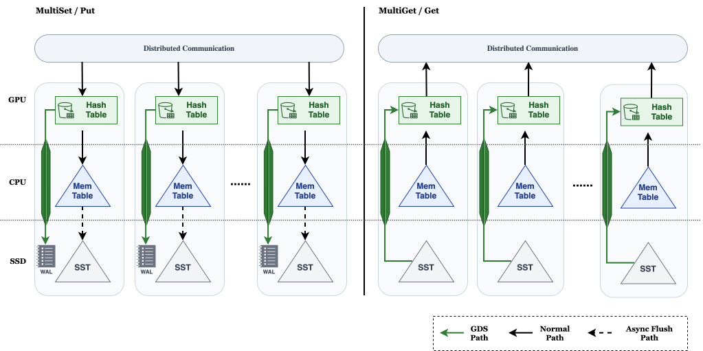

# MLKV+ [Under Development]
It is a general-purpose, distributed, heterogeneous, and modular key–value data framework for GPU Ap-
plication(e.g. Embedding Model Training). It integrates two complementary bindings: a GPU-resident
layer for high-throughput in-memory access and a CPU/disk layer for large-scale persistent storage. Be-
tween these bindings, MLKV+ employs application-aware data migration and multiple optimized transfer
paths—including GPU’s High-Bandwidth Memory (HBM) ↔ DRAM ↔ SSD and direct HBM ↔ SSD
pipelines. 




## How to build MLKV+
It will build the PyTorch extension and the libmlkvplus library.
```bash
# clone submodule
git submodule update --init --recursive

# create conda envs
conda env create -f env.yml
conda activate mlkv_plus

# build MLKV+(PyTorch)
MAX_JOBS=$(($(nproc)-1)) CUDA_SM="86" pip install -e .
```
* Please change `CUDA_SM` to your own [Computer Compacity](https://developer.nvidia.com/cuda-gpus) of GPU.
* You can change `MAX_JOBS` to your wanted number of jobs to compile.


## Playground of MLKV+
Warning: The playground is not perfect currently, it may raise CUDA errors in some cases.
* You can run the single node playground by:
    ```bash
    python playground/mlkvp_playground.py
    ```
* You can run the distributed playground by:
    ```bash
    torchrun --nproc_per_node=4 playground/dist_mlkvp_playground.py
    ```
    * Please change `--nproc_per_node` to your wanted number of GPUs.

## How to build libmlkvplus
```bash
# clone submodule
git submodule update --init --recursive

# create conda envs
conda env create -f env.yml
conda activate mlkv_plus

# build libmlkvplus
mkdir -p build && cd ./build
cmake .. -Dsm=86 && make -j$(($(nproc)-1)) && cmake --install . --component gycsb_python_binding
```
* Please change `-Dsm` to your own [Computer Compacity](https://developer.nvidia.com/cuda-gpus) of GPU.

## Benchmark

We use [gYCSB](https://github.com/haiqiang-zhang/gYCSB) framework to benchmark MLKV+ performance.
* Please ensure that you already clone the submodule of gYCSB and build libmlkvplus or MLKV+ (PyTorch + libmlkvplus).
* Installing gYCSB in the root directory by:
    ```bash
    pip install -e ./gYCSB
    ```
* Running a simple benchmark by:
    ```bash
    gycsb singlerun --runner_config gycsb_running_config.yaml --running_name mlkv_plus
    ```


## How to install GPUDirect Storage
To be added

## Known Issues

- [ ] **G-Page Cache IO Errors**: The G-Page Cache may encounter IO errors during `Get` operations, such as:
  ```
  Failed to get from SST files: IO error: GDS read failed: Incomplete GDS read: 
  requested 262144 bytes (aligned), got 262144 bytes at offset 10223616, 
  need at least 265268 bytes for requested range
  ```

- [ ] **MultiGet Operation**: The `MultiGet` logic has known limitations and maybe degrade the performance at some special cases.

- [ ] **PyTorch Binding**: The PyTorch binding may occasionally raise CUDA errors:
  ```
  torch.AcceleratorError: CUDA error: __global__ function call is not configured
  ```